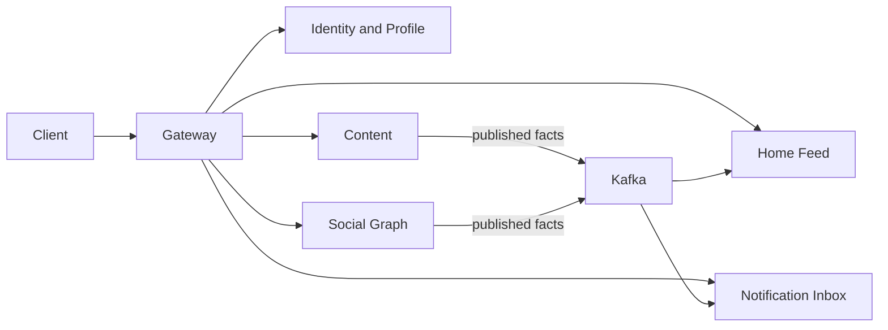

# Social Media Platform

A Spring Boot 4 project built to demonstrate context separation, authenticated HTTP traffic,
asynchronous updates, and failure-aware event delivery without claiming production-scale
infrastructure.

## Architecture



Each context owns its PostgreSQL database. Content and Social Graph store outbound facts in the
same transaction as their domain changes; scheduled publishers deliver those facts to Kafka.
Home Feed and Notification Inbox consume them asynchronously.

## Run locally

Requirements: Java 21, Docker Compose, and OpenSSL.

1. Copy `.env.example` to `.env` and replace every `change-me` value.
2. Create `secrets/jwt-private.pem` and `secrets/jwt-public.pem` with OpenSSL.
3. Set `JWT_KEYS_GID` in `.env` to the output of `id -g`.
4. Start everything with `docker compose up --build`.
5. Import `postman/SocialMedia.postman_collection.json` and its local environment.

Run the checks with:

```bash
./mvnw test
```

## Delivery guarantees

- Delivery is **at least once**, so duplicates are expected.
- Notification Inbox records processed fact IDs before creating Notifications.
- Home Feed uses a unique Account/Post constraint, making fan-out retries idempotent.
- Reads are **eventually consistent** after a Post or Follow Relationship changes.
- Correlation IDs cross HTTP and Kafka for traceable logs.

## Deliberate limits

- Home Feed uses fan-out-on-write for fast reads. Very large follower counts would need durable,
  chunked fan-out work or a hybrid read strategy.
- A new Follow Relationship does not backfill historical Posts.
- Published facts use versioned JSON without a schema registry; strict contract tests are the next
  step if independent deployment becomes a goal.
- Small duplicated configuration remains local to each context to avoid a shared framework.
